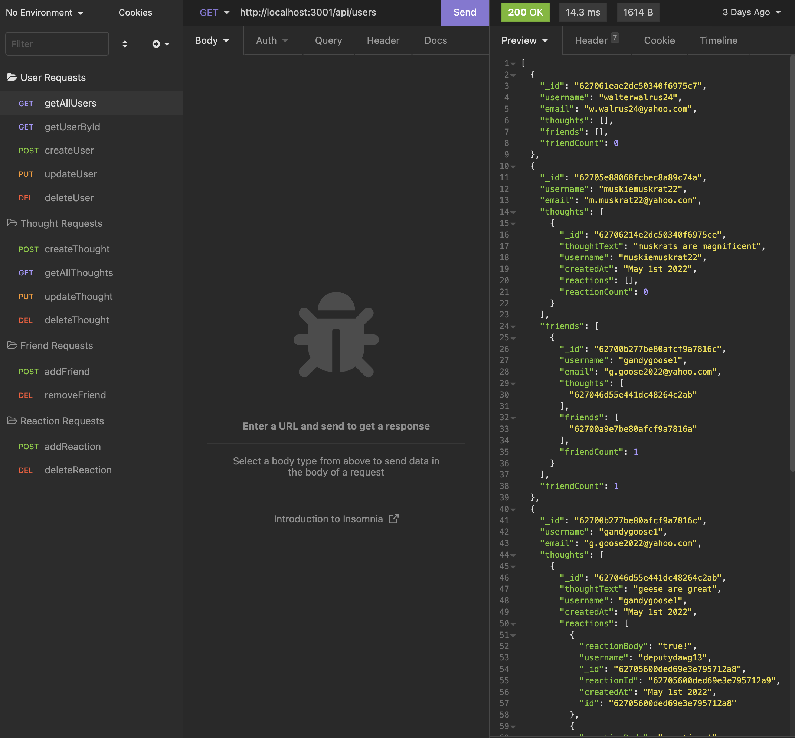

# That Social API

That Social API is an API developed for a social network web application that uses a NoSQL database and allows users to add friends, share thoughts, and react to friends' thoughts.

## Installation

To run this app on your local machine, you will want to clone this repository and install MySQL and Node. Then, open your terminal and type in "npm install" to install npm packages. The screenshot above shows CRUD requests in Insomnia, which is a cross-platform application that serves as a REST API client. I recommend installing Insomnia to test out That Social.

## Usage

* Navigate to the root folder in your terminal 
* Type in "npm start" to start the server
* Open insomnia and make GET, POST, PUT, and DELETE requests to start building the users, their thoughts, friends, and reactions in the database

Click [here](https://drive.google.com/file/d/1PwqtvCF1aMpe3wh2-CO65VaRlv5Hh1Vu/view) to watch an instructional video

## Technologies

* Javascript
* MongoDB
* Express.js
* Mongoose
* Moment

## Contributers

* Brandon Henry
